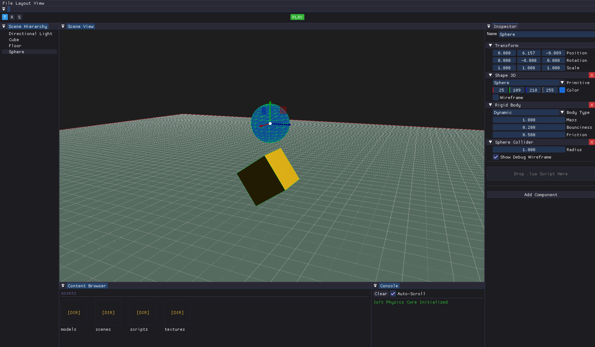

# MiniEngineRaylib

**MiniEngineRaylib** is a modular, 3D game engine and editor written in **C++20**. 

Originally built as a lightweight wrapper over [Raylib](https://www.raylib.com/), the engine has evolved into a full-featured development environment. It features a custom Entity-Component-System (ECS), a AAA physics backend, live Lua scripting, and a complete UI editor, making it an ideal platform for rapid prototyping and learning advanced engine architecture.

  

## Core Features

- **Integrated Editor (ImGui):** A fully dockable UI featuring a Scene Hierarchy, Entity Inspector, and interactive 3D Gizmos for real-time level design.
- **Entity-Component-System (ECS):** A lightweight, contiguous-memory architecture that seamlessly syncs visual data, physics bounds, and logic in real-time.
- **GPU-Accelerated 3D Rendering:** A custom Blinn-Phong shader pipeline supporting multi-light architecture (Directional and Point lights) with physically based attenuation.
- **Jolt Physics Backend:** Professional-grade 3D physics integration supporting Dynamic, Kinematic, and Static rigidbodies with real-time debug wireframe rendering.
- **Lua Scripting & Hot-Reloading:** Write gameplay logic in Lua using `Sol3`. The engine detects file changes and hot-reloads scripts instantly without recompiling the C++ core.
- **Data-Oriented Scene Serialization:** Save and load complete scenes (including all components and script states) to JSON.

## Getting Started

### Requirements

- **C++20** compatible compiler (MSVC, GCC, or Clang)
- **CMake 3.20+**
- **Git**
- **[vcpkg](https://github.com/microsoft/vcpkg)** (for dependency management)

### 1. Cloning the Repository

This project uses Git submodules for core engine components. You **must** clone it recursively to fetch all the required source code.

```bash
git clone --recursive [https://github.com/Vasco-Alves/mini-engine-raylib.git](https://github.com/Vasco-Alves/mini-engine-raylib.git)
cd mini-engine-raylib
```

*(If you already cloned it normally, run `git submodule update --init --recursive` to pull the missing files).*

### 2. Building the Engine

This project uses **CMake** and **vcpkg** to automatically fetch and link external dependencies. Ensure you have the `VCPKG_ROOT` environment variable set to your vcpkg installation path.

**Using Command Line:**

```bash
# Configure the project
cmake -B out/build -S . -DCMAKE_TOOLCHAIN_FILE="$env{VCPKG_ROOT}/scripts/buildsystems/vcpkg.cmake"

# Build the project
cmake --build out/build
```

**Using Visual Studio / VS Code:**

1. Open the repository folder.
2. CMake Presets should automatically detect the toolchain (see `CMakePresets.json`).
3. Select a preset (e.g., `x64-debug`) and hit **Build**.

### 3. Running the Editor

The executable is built into `out/build/<preset>/bin/`. Asset files and default shaders are automatically copied to the output directory during the build process.

```bash
./out/build/x64-debug/bin/editor.exe
```

## Architecture & Dependencies

MiniEngineRaylib bridges a custom data-oriented core with robust industry standards to create a seamless development pipeline:

### Submodules

- [**Mini-ECS**](https://www.google.com/search?q=https://github.com/YOUR_USERNAME/mini-ecs): A custom-built, lightweight Entity-Component-System engineered specifically for this engine to handle contiguous memory pools and fast component iteration.

### External Libraries (via vcpkg)

- [**Raylib**](https://github.com/raysan5/raylib): Core windowing, input processing, and rendering context.
- [**Dear ImGui**](https://github.com/ocornut/imgui): Powers the entire Editor UI (Inspector, Hierarchy, Viewports) via `rlImGui`.
- [**Jolt Physics**](https://github.com/jrouwe/JoltPhysics): Multi-threaded AAA 3D collision and rigidbody simulation.
- [**sol3**](https://github.com/ThePhD/sol2): A C++ bindings library that bridges the engine architecture to the Lua scripting environment.
- [**nlohmann/json**](https://github.com/nlohmann/json): Handles data parsing and Scene serialization.

## Future Improvements & Roadmap

While the engine is highly capable, there is always room to grow. Planned features include:

- **Audio Subsystem:** 3D positional audio sources and mixer channels (Music, SFX, UI).
- **Standalone Build Pipeline:** Exporting the current scene into a stripped-down, Editor-free game executable.
- **Advanced Rendering:** Shadow mapping, post-processing stack (bloom, color grading), and skeletal animation support.
- **Prefab System:** Saving complex entity hierarchies as reusable disk assets.
